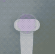

- [View Animations](#view-animations)
    
    - [Animatable properties](#animatable-properties)
        
    - [frame bounds transform之间的关系](#frame-bounds-transform之间的关系)
        
    -   [Animation options](#Animation-options)
        
    -   [SpringAnimations](#SpringAnimations)
        
    -   [TransitionAnimations](#TransitionAnimations)
        
    -   [Keyframe](#Keyframe)
        
- [Layer Animations](#Layer-Animations)
    
    -   [View Animation 和 Layer Animation的区别](#View-Animation-和-Layer-Animation的区别)
        
    -   [Animation Properties](#Animation-Properties)
        
    -   [postion anchorPoint frame bounds之间的区别](#postion-anchorPoint-frame-bounds之间的区别)
        
    -   [fillMode](#fillMode:-forwards-backwards-both-removed的区别)
        
    -   [CAAnimationGroup](#CAAnimationGroup)
        
    -   [Animation easing](#Animationeasing)
        
    -   [Layer Springs - CASpringAnimation](#Layer-Springs---CASpringAnimation)
        
    -   [Layer Keyframe Aniamtions - CAKeyframeAnimation](#Layer-Keyframe-Aniamtions---CAKeyframeAnimation)
        
-   [Code Block](#代码块)

### View Animations

```swift
 UIView.animate(withDuration: 0.25,
                   delay: 0,
                   options: [],
                   animations: {

    }, completion: nil)
```

#### Animatable properties

- bounds

- frame

- center

- backgroundColor

- alpha

- transform

#### frame bounds transform之间的关系

- frame: 当前相对父视图的坐标系的位置和大小

- bounds：自身坐标系的位置和大小，觉得subViews的frame

- transform 变换（位移动，缩放，旋转），transform改变时，会影响frame，不会影响bounds

#### Animation options： 详见 [AnimationOptions](https://developer.apple.com/documentation/uikit/uiview/animationoptions)

```swift
UIView.animate(withDuration: 0.5, delay: 0.4,
  options: .repeat,
  animations: {
    self.password.center.x += self.view.bounds.width
  },
  completion: nil
)
```

Animation easing

- curveLinear: 匀速动画

- .curveEaseIn: 动画开始时加速

- .curveEaseOut: 动画结束时，减速

- .curveEaseInOut: 动画开始时加速， 减速

#### SpringAnimations

```swift
UIView.animate(withDuration: 0.5, 
                       delay: 0.5,
        usingSpringWithDamping: 0.5, 
        initialSpringVelocity: 0.0,
        options: [],
        animations: {
          self.loginButton.center.y -= 30.0
          self.loginButton.alpha = 1.0
        }, completion: nil)
```

- usingSpringWithDamping:  取值在 0 ~ 1.0，值越大，弹簧的刚度越大

- initialSpringVelocity:  控制动画的初始速度。 值1.0设置动画的速度以覆盖动画的总距离（在一秒的跨度内）。 较大和较小的值将导致动画具有或多或少的速度。

#### TransitionAnimations

用于转场的动画Options

- .transitionFlipFromLeft 

- .transitionFlipFromRight 

- .transitionCurlUp

- .transitionCurlDown 

- .transitionCrossDissolve

- .transitionFlipFromTop 

- .transitionFlipFromBottom

##### 使用转场动画的场景：

- 添加View时
  
  ```swift
  UIView.transition(with: animationContainerView,
                   duration: 0.33,
                   options: [.curveEaseOut, .transitionFlipFromBottom],
                   animations: {
                       self.animationContainerView.addSubview(newView)
                  },
                   completion: nil
   )
  ```

- 移除View时
  
  ```swift
  UIView.transition(with: animationContainerView, 
                  duration: 0.33,
                   options: [.curveEaseOut, .transitionFlipFromBottom],
                animations: {
                  self.newView.removeFromSuperview()
                },
                completion: nil
  )
  ```

- 隐藏或显示View时
  
  ```swift
  UIView.transition(with: self.newView, 
                duration: 0.33,
                 options: [.curveEaseOut, .transitionFlipFromBottom],
               animations: {
              self.newView.isHidden = true
            },
                completion: nil
  )
  ```

- 替换View时
  
  ```swift
  UIView.transition(from: oldView, 
                      to: newView, 
                      duration: 0.33,
                      options: 
                      .transitionFlipFromTop,
                       completion: nil)
  ```

#### Keyframe

- options:  详情查看UIViewKeyframeAnimationOptions

```swift
 UIView.animateKeyframes(withDuration: 1.5, delay: 0.0, animations: {
      //add keyframes
      UIView.addKeyframe(withRelativeStartTime: 0.0, relativeDuration: 0.25, animations: {
        self.planeImage.center.x += 80.0
        self.planeImage.center.y -= 10.0
      })

      UIView.addKeyframe(withRelativeStartTime: 0.1, relativeDuration: 0.4) {
        self.planeImage.transform = CGAffineTransform(rotationAngle: -.pi / 8)
      }

      UIView.addKeyframe(withRelativeStartTime: 0.25, relativeDuration: 0.25) {
        self.planeImage.center.x += 100.0
        self.planeImage.center.y -= 50.0
        self.planeImage.alpha = 0.0
      }

      UIView.addKeyframe(withRelativeStartTime: 0.51, relativeDuration: 0.01) {
        self.planeImage.transform = .identity
        self.planeImage.center = CGPoint(x: 0.0, y: originalCenter.y)
      }

      UIView.addKeyframe(withRelativeStartTime: 0.55, relativeDuration: 0.45) {
        self.planeImage.alpha = 1.0
        self.planeImage.center = originalCenter
      }
    }, completion: nil)
```

### 

### Layer Animations

#### View Animation 和 Layer Animation的区别

- layer与View（就动画而言）不同，原因如下：
  
  - 图层是模型对象–它公开数据属性并且不实现任何逻辑。 它没有复杂的自动版式依赖性，也没有处理用户交互。
  
  - 它具有预定义的可见特征-这些特征是许多数据属性，它们会影响内容在屏幕上的呈现方式，例如边界线，边界颜色，位置和阴影。（预先会绘制一个layer）
  
  - Core Animation直接在GPU上优化了图层内容的缓存和快速绘制。

##### Views

- 视图布局，层级复杂

- 存在用户用户交互

- 通常具有在CPU的主线程上执行的自定义逻辑或自定义绘图代码

- 非常灵活，强大，有很多子类可以继承

##### Layers

- 层次结构简单，布局解析速度快，绘制速度快。

- 没有响应者链开销。

- 默认情况下没有自定义逻辑。 并直接在GPU上绘制。

- 不够灵活，子类继承较少

##### Layer动画流程

设置Layer动画时，控件本身本身不具有动画效果，当动画开始时，预先渲染的动画layer（**presentation layer**）将会替代控件，同时控件暂时隐藏，动画过程中不能交互

 动画完成后  **presentation layer** 将从屏幕上删除，原始Layer再次显示自己。（动画结束需要更新layer的属性值为动画结束时的值）

#### Animation Properties

- bounds

- postion: position.x position.y

- transform :transform.scale(x, y, z), transform.roate(x, y, z)

- border: boorderWidth, backroudClolor, borderColor, corner

- shadow: shadowOffset, shadowOpacity, shadowPath, shadowRadius

- contents

- mask

- opacity

- path

- strokeEnd

- strokeStart

```swift
let flyRight = CABasicAnimation(keyPath: "position.x")
flyRight.fromValue = -view.bounds.size.width / 2
flyRight.toValue = view.bounds.size.width / 2
flyRight.fillMode = .forwards
```

##### postion, anchorPoint, frame, bounds之间的区别

- anchorPoint(锚点): 视图的几何操作（旋转，平移，缩放）的中心，

- position 是相对layer的anchoorPoint 相对于superLayer的位置，即View的center
  
  ```
  postion.x = frame.origin.x + anchorPont.x * frame.width
  postion.y = frame.origin.y + anchorPont.y * frame.height
  ```

- frame 当前layer相对superLayer的位置和大小, 最终由View体现
  
  ```swift
  frame.x = postion.x - anchorPont.x * frame.width
  frame.y = postion.y - anchorPont.y * frame.height
  ```

- bounds 当layer自身的坐标系的位置和大小

##### fillMode: forwards, backwards, both，removed的区别

- forwards: 动画结束停留在最后一帧

- backwards：动画开始前，处于动画的第一帧

- both：结合了forwards与backwards的特点，即动画开始前，处于动画的第一帧，动画结束停留在最后一帧

- removed：动画结束，移除动画

##### CAAnimationGroup

```swift
let groupAnimation = CAAnimationGroup()
groupAnimation.beginTime = CACurrentMediaTime() + 0.5
groupAnimation.duration = 0.5
groupAnimation.fillMode = .backwards
group.timingFunction = CAMediaTimingFunction(name: .easeInEaseOut)let scaleDown = CABasicAnimation(keyPath: "transform.scale")s
caleDown.fromValue = 3.5
scaleDown.toValue = 1.0
let rotate = CABasicAnimation(keyPath: "transform.rotation")
rotate.fromValue = .pi / 4.0
rotate.toValue = 0.0
let fade = CABasicAnimation(keyPath: "opacity")fade.fromValue = 0.0
fade.toValue = 1.0
groupAnimation.animations = [scaleDown, rotate, fade]
```

#### Animation easing

- **EaseIn**
  
  

- [*]()*EaseOut**


- **EaseInEaseOut**

    

#### More timing options

- Repeating animations
  
  ```swift
  flyLeft.repeatCount = 4
  flyLeft.autoreverses = true
  ```

- Change the animation speed
  
  ```swift
  flyLeft.speed = 2.0
  ```

### Layer Springs - CASpringAnimation

- damping: 阻尼系数， 阻止弹簧伸缩的系数，阻尼系数越大，停止越快

- mass: 运动的质量，影响图层运动时的弹簧惯性，质量越大，弹簧拉伸和压缩的幅度越大, 默认为1.0

- stiffness:  刚度，默认为100，为正，为0时，弹性越软，值越大，弹性越硬

- initialVelocity： 初始的速度，速率为正数时，速度方向与运动方向一致，速率为负数时，速度方向与运动方向相反

- settlingDuration 估算时间 返回弹簧动画到停止时的估算时间，根据当前的动画参数估算

```swift
let jump = CASpringAnimation(keyPath: "position.y")
jump.initialVelocity = 100.0
jump.mass = 10.0
jump.stiffness = 1500.0
jump.damping = 50.0
jump.fromValue = textField.layer.position.y + 1.0
jump.toValue = textField.layer.position.y
jump.duration = jump.settlingDuration

let flash = CASpringAnimation(keyPath: "borderColor")
flash.damping = 7.0
flash.stiffness = 200.0
flash.fromValue = UIColor(red: 1.0, green: 0.27, blue: 0.0, alpha:
1.0).cgColor
flash.toValue = UIColor.white.cgColor
flash.duration = flash.settlingDuration
textField.layer.add(flash, forKey: nil)
```

### Layer Keyframe Aniamtions - CAKeyframeAnimation

#### 几个重要的属性

- values： 动画的值

- path：动画的路径

- keyTimes：帧时长

- timingFunctions：帧时间函数

- calculationMode: 帧计算模式

```swift
let wobble = CAKeyframeAnimation(keyPath: "transform.rotation")
wobble.duration = 0.25
wobble.repeatCount = 4
wobble.values = [0.0, -.pi/4.0, 0.0, .pi/4.0, 0.0]
wobble.keyTimes = [0.0, 0.25, 0.5, 0.75, 1.0]
heading.layer.add(wobble, forKey: nil)
```

### 代码块


```swift
/// 矩形变为圆形动画
 fileprivate func circularAnimations() {
     let groupAnimation = CAAnimationGroup()
     groupAnimation.beginTime = CACurrentMediaTime()
     groupAnimation.duration = 0.1
     groupAnimation.fillMode = "forwards"
     groupAnimation.isRemovedOnCompletion = false
     
     let bounds = CABasicAnimation(keyPath: "bounds")
     bounds.fromValue = gradientLayer.bounds
     bounds.toValue = layerBoundsInView
   
     let cornerRadius = CABasicAnimation(keyPath: "cornerRadius")
     cornerRadius.timingFunction = CAMediaTimingFunction(name: "linear")
     cornerRadius.fromValue = 8
     cornerRadius.toValue = UISize.btnHeight * 0.5                                   
     groupAnimation.animations = [bounds, cornerRadius]
     gradientLayer.add(groupAnimation, forKey: "group")
 }
```

```swift
   /// 打钩画，
   /// 1.绘制出勾勾的路径 
   /// 2.用shapelayer的strokeEnd做动画
   func showAnimation() {
        shapelayer.strokeEnd = 1
        let group = CAAnimationGroup()
        group.duration = 0.25
        group.isRemovedOnCompletion = false
        group.fillMode = .forwards
        group.timingFunction = CAMediaTimingFunction(name: .easeInEaseOut)

        let strokeEnd = CABasicAnimation(keyPath: "strokeEnd")
        strokeEnd.fromValue = 0
        strokeEnd.toValue = 1
        strokeEnd.duration = 0.25
        strokeEnd.timingFunction = CAMediaTimingFunction(name: .easeInEaseOut)

        let scale = CABasicAnimation(keyPath: "transform.scale")
        scale.fromValue = 1
        scale.toValue = 1.2
        scale.fillMode = .forwards
        scale.isRemovedOnCompletion = false
        scale.duration = 0.1

        group.animations = [strokeEnd]
        shapelayer.add(group, forKey: nil)

        scale.beginTime = CACurrentMediaTime() + 0.25
        scale.fromValue = 1
        scale.toValue = 0.9
        scale.timingFunction = CAMediaTimingFunction(name: .easeInEaseOut)
        shapelayer.add(scale, forKey: nil)
    }
```


```swift
/// 呼吸动画
 func showAniamtion() {
     let scale = CAKeyframeAnimation(keyPath: "transform.scale")
     scale.repeatCount = MAXFLOAT
     scale.values = [1, 1.3, 1]
     scale.keyTimes = [0, 0.5, 1]
     scale.duration = 1.5
     scale.beginTime = 0.25
     layer.add(scale, forKey: "scale")
 }
```



```swift
/// 圈圈的出现动画
func show() {
     let group = CAAnimationGroup()
     group.timingFunction = CAMediaTimingFunction(name: "easeInEaseOut")
     group.fillMode = "backwards"
     group.isRemovedOnCompletion = false
     group.setValue("show", forKey: "name")
     group.delegate = self
     group.duration = 0.3
     let scale = CAKeyframeAnimation(keyPath: "transform.scale")
     scale.values = [0, 1.5, 1]
     scale.duration = 0.3
     scale.calculationMode = "linear"
     let opacity = CABasicAnimation(keyPath: "opacity")
     opacity.fromValue = 0
     opacity.toValue = 1
     opacity.duration = 0.3
     group.animations = [scale, opacity]
     dot1.layer.add(group, forKey: nil)
}
```


```swift
/// 圈圈的消失动画
 func endShow(_ dotType: DotType = .double, 
             completion: ((Bool) -> Void)? = nil) {
    let dismissGroup = CAAnimationGroup()
    dismissGroup.timingFunction = CAMediaTimingFunction(name: "linear")
    dismissGroup.fillMode = "forwards"
    dismissGroup.isRemovedOnCompletion = false
    dismissGroup.duration = 0.15
    dismissGroup.delegate = self
    dismissGroup.setValue("dismissGroup", forKey: "name")
    let dismissOpacity = CABasicAnimation(keyPath: "opacity")
    dismissOpacity.fromValue = 1
    dismissOpacity.toValue = 0
    
    let scale = CABasicAnimation(keyPath: "transform.scale")
    scale.fromValue = 1
    scale.toValue = 1.5
    dismissGroup.animations = [scale, dismissOpacity]
    self.animationCompletion = completion
    dot1.layer.add(dismissGroup, forKey: nil)
 }
```

### 

```swift
    /// 切换layer动画
  fileprivate func exchangeSuperLayer() {
        let gradientBounds = gradientLayer.convert(gradientLayer.bounds, to: self.layer)
        gradientLayer.removeFromSuperlayer()
        bottomShadowLayer.removeFromSuperlayer()
        CATransaction.begin()
        CATransaction.setDisableActions(true)
        gradientLayer.frame = gradientBounds
        CATransaction.commit()
        layer.addSublayer(gradientLayer)
        layerBoundsInView = CGRect(x: gradientBounds.origin.x + gradientBounds.width/2 -  UISize.btnHeight * 0.5, y: gradientBounds.origin.y, width:  UISize.btnHeight, height:  UISize.btnHeight)
    }

    /// 曲线移动动画
    fileprivate func moveToNavAnimation() {
        let position = CAKeyframeAnimation(keyPath: "position")
        position.fillMode = "forwards"
        position.isRemovedOnCompletion = false
        let fromPoint = CGPoint(x: layerBoundsInView.origin.x +  
                                    UISize.btnHeight * 0.5,
                                y: layerBoundsInView.origin.y +  
                                    UISize.btnHeight * 0.5)
        let endPoint = CGPoint(x: destinationRect.origin.x +  
                                    UISize.btnHeight * 0.5,
                               y: destinationRect.origin.y +  
                                   UISize.btnHeight * 0.5)
        let path = UIBezierPath()
        path.move(to: fromPoint)
        let controlPoint1 = CGPoint(x: fromPoint.x + 100, y: fromPoint.y     - 100)
        path.addCurve(to: endPoint, controlPoint1: controlPoint1, controlPoint2: endPoint)
        position.path = path.cgPath
        position.duration = 0.3
        position.timingFunction = CAMediaTimingFunction(name: "easeInEaseOut")
        gradientLayer.add(position, forKey: "position")
    }
```

#### 渐变色圈圈


```swift
/// 线宽决定圈圈的大小
shapeLapyer.lineWidth = destinationRect.height
shapeLapyer.path = UIBezierPath(roundedRect: CGRect(x: 0, y: 0, width: destinationRect.height, height: destinationRect.height), cornerRadius: destinationRect.height * 0.5).cgPath
gradientLayer.frame = destinationRect
gradientLayer.removeAllAnimations()
gradientLayer.mask = shapeLapyer
gradientLayer.cornerRadius = destinationRect.height * 0.5

/// 或者可以设置borderWidth
shapeLapyer.borderWidth = 1
shapeLapyer.cornerRadius =  destinationRect.height * 0.5
shapeLapyer.frame = CGRect(x: 0, y: 0, width: destinationRect.height, height: destinationRect.height)
```

### 
