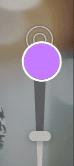

### View Animations

```swift
 UIView.animate(withDuration: 0.25,
                   delay: 0,
                   options: [],
                   animations: {

    }, completion: nil)
```

#### Animatable properties

- bounds

- frame

- center

- backgroundColor

- alpha

- transform

#### Animation options： 详见 [AnimationOptions](https://developer.apple.com/documentation/uikit/uiview/animationoptions)

```swift
UIView.animate(withDuration: 0.5, delay: 0.4,
  options: .repeat,
  animations: {
    self.password.center.x += self.view.bounds.width
  },
  completion: nil
)
```

Animation easing

- ##### curveLinear:  匀速动画

- .curveEaseIn: 动画开始时加速

- .curveEaseOut: 动画结束时，减速

- .curveEaseInOut: 动画开始时加速， 减速

#### SpringAnimations

```swift
UIView.animate(withDuration: 0.5, 
                       delay: 0.5,
        usingSpringWithDamping: 0.5, 
        initialSpringVelocity: 0.0,
        options: [],
        animations: {
          self.loginButton.center.y -= 30.0
          self.loginButton.alpha = 1.0
        }, completion: nil)
```

- usingSpringWithDamping:  取值在 0 ~ 1.0，值越大，弹簧的刚度越大

- initialSpringVelocity:  控制动画的初始速度。 值1.0设置动画的速度以覆盖动画的总距离（在一秒的跨度内）。 较大和较小的值将导致动画具有或多或少的速度。

#### TransitionAnimations

用于转场的动画Options

- .transitionFlipFromLeft 

- .transitionFlipFromRight 

- .transitionCurlUp

- .transitionCurlDown 

- .transitionCrossDissolve

- .transitionFlipFromTop 

- .transitionFlipFromBottom

##### 使用转场动画的场景：

- 添加View时
  
  ```swift
  UIView.transition(with: animationContainerView,
                   duration: 0.33,
                   options: [.curveEaseOut, .transitionFlipFromBottom],
                   animations: {
                       self.animationContainerView.addSubview(newView)
                  },
                   completion: nil
   )
  ```

- 移除View时
  
  ```swift
  UIView.transition(with: animationContainerView, 
                  duration: 0.33,
                   options: [.curveEaseOut, .transitionFlipFromBottom],
                animations: {
                  self.newView.removeFromSuperview()
                },
                completion: nil
  )
  ```

- 隐藏或显示View时
  
  ```swift
  UIView.transition(with: self.newView, 
                duration: 0.33,
                 options: [.curveEaseOut, .transitionFlipFromBottom],
               animations: {
              self.newView.isHidden = true
            },
                completion: nil
  )
  ```

- 替换View时
  
  ```swift
  UIView.transition(from: oldView, 
                      to: newView, 
                      duration: 0.33,
                      options: 
                      .transitionFlipFromTop,
                       completion: nil)
  ```

#### Keyframe

- options:  详情查看UIViewKeyframeAnimationOptions

```swift
 UIView.animateKeyframes(withDuration: 1.5, delay: 0.0, animations: {
      //add keyframes
      UIView.addKeyframe(withRelativeStartTime: 0.0, relativeDuration: 0.25, animations: {
        self.planeImage.center.x += 80.0
        self.planeImage.center.y -= 10.0
      })

      UIView.addKeyframe(withRelativeStartTime: 0.1, relativeDuration: 0.4) {
        self.planeImage.transform = CGAffineTransform(rotationAngle: -.pi / 8)
      }

      UIView.addKeyframe(withRelativeStartTime: 0.25, relativeDuration: 0.25) {
        self.planeImage.center.x += 100.0
        self.planeImage.center.y -= 50.0
        self.planeImage.alpha = 0.0
      }

      UIView.addKeyframe(withRelativeStartTime: 0.51, relativeDuration: 0.01) {
        self.planeImage.transform = .identity
        self.planeImage.center = CGPoint(x: 0.0, y: originalCenter.y)
      }

      UIView.addKeyframe(withRelativeStartTime: 0.55, relativeDuration: 0.45) {
        self.planeImage.alpha = 1.0
        self.planeImage.center = originalCenter
      }
    }, completion: nil)
```

### 

### Layer Animations

#### View Animation 和 Layer Animation的区别

- layer与View（就动画而言）不同，原因如下：
  
  - 图层是模型对象–它公开数据属性并且不实现任何逻辑。 它没有复杂的自动版式依赖性，也没有处理用户交互。
  
  - 它具有预定义的可见特征-这些特征是许多数据属性，它们会影响内容在屏幕上的呈现方式，例如边界线，边界颜色，位置和阴影。（预先会绘制一个layer）
  
  - Core Animation直接在GPU上优化了图层内容的缓存和快速绘制。

##### Views

- 视图布局，层级复杂

- 存在用户用户交互

- 通常具有在CPU的主线程上执行的自定义逻辑或自定义绘图代码

- 非常灵活，强大，有很多子类可以继承

##### Layers

- 层次结构简单，布局解析速度快，绘制速度快。

- 没有响应者链开销。

- 默认情况下没有自定义逻辑。 并直接在GPU上绘制。

- 不够灵活，子类继承较少


##### Layer动画流程

设置Layer动画时，控件本身本身不具有动画效果，当动画开始时，预先渲染的动画layer（**presentation layer**）将会替代控件，同时控件暂时隐藏，动画过程中不能交互

 动画完成后  **presentation layer** 将从屏幕上删除，原始Layer再次显示自己。（动画结束需要更新layer的属性值为动画结束时的值）


#### Animation Properties

- bounds

- postion: position.x position.y

- transform :transform.scale(x, y, z), transform.roate(x, y, z)

- border: boorderWidth, backroudClolor, borderColor, corner

- shadow: shadowOffset, shadowOpacity, shadowPath, shadowRadius

- contents

- mask

- opacity

- path

- strokeEnd

- strokeStart

```swift
let flyRight = CABasicAnimation(keyPath: "position.x")
flyRight.fromValue = -view.bounds.size.width / 2
flyRight.toValue = view.bounds.size.width / 2
flyRight.fillMode = .forwards
```

##### postion, anchorPoint, frame, bounds, center之间的区别

- position 是相对layer的anchoorPoint 相对于superLayer的位置
  
  ```
  postion.x = frame.origin.x + anchorPont.x * frame.width
  postion.y = frame.origin.y + anchorPont.y * frame.height
  ```

- frame 当前layer相对superLayer的位置和大小, 最终由View体现
  
  ```swift
  frame.x = frame.origin.x + anchorPont.x * frame.width
  postion.y = frame.origin.y + anchorPont.y * frame.height
  ```
  
  

##### fillMode: forwards, backwards, both，removed的区别

- forwards: 动画结束停留在最后一帧

- backwards：动画开始前，处于动画的第一帧

- both：结合了forwards与backwards的特点，即动画开始前，处于动画的第一帧，动画结束停留在最后一帧

- removed：动画结束，移除动画

##### CAAnimationGroup

```swift
let groupAnimation = CAAnimationGroup()groupAnimation.beginTime = CACurrentMediaTime() + 0.5
groupAnimation.duration = 0.5
groupAnimation.fillMode = .backwards
group.timingFunction = CAMediaTimingFunction(name: .easeInEaseOut)let scaleDown = CABasicAnimation(keyPath: "transform.scale")s
caleDown.fromValue = 3.5scaleDown.toValue = 1.0
let rotate = CABasicAnimation(keyPath: "transform.rotation")
rotate.fromValue = .pi / 4.0
rotate.toValue = 0.0
let fade = CABasicAnimation(keyPath: "opacity")fade.fromValue = 0.0
fade.toValue = 1.0
groupAnimation.animations = [scaleDown, rotate, fade]
```

#### Animation easing

- **EaseIn**
  
  

- [*]()*EaseOut**


- **EaseInEaseOut**

    

#### More timing options

- Repeating animations
  
  ```swift
  flyLeft.repeatCount = 4flyLeft.autoreverses = true
  ```

- Change the animation speed
  
  ```swift
  flyLeft.speed = 2.0
  ```

### Layer Springs - CASpringAnimation

- damping: 阻尼系数， 阻止弹簧伸缩的系数，阻尼系数越大，停止越快

- mass: 运动的质量，影响图层运动时的弹簧惯性，质量越大，弹簧拉伸和压缩的幅度越大, 默认为1.0

- stiffness:  刚度，默认为100，为正，为0时，弹性越软，值越大，弹性越硬

- initialVelocity： 初始的速度，速率为正数时，速度方向与运动方向一致，速率为负数时，速度方向与运动方向相反

- settlingDuration 估算时间 返回弹簧动画到停止时的估算时间，根据当前的动画参数估算

```swift
let jump = CASpringAnimation(keyPath: "position.y")
jump.initialVelocity = 100.0
jump.mass = 10.0
jump.stiffness = 1500.0
jump.damping = 50.0
jump.fromValue = textField.layer.position.y + 1.0
jump.toValue = textField.layer.position.y
jump.duration = jump.settlingDuration

let flash = CASpringAnimation(keyPath: "borderColor")
flash.damping = 7.0
flash.stiffness = 200.0
flash.fromValue = UIColor(red: 1.0, green: 0.27, blue: 0.0, alpha:
1.0).cgColor
flash.toValue = UIColor.white.cgColor
flash.duration = flash.settlingDuration
textField.layer.add(flash, forKey: nil)
```

### Layer Keyframe Aniamtions - CAKeyframeAnimation

```swift
let wobble = CAKeyframeAnimation(keyPath: "transform.rotation")
wobble.duration = 0.25
wobble.repeatCount = 4
wobble.values = [0.0, -.pi/4.0, 0.0, .pi/4.0, 0.0]
wobble.keyTimes = [0.0, 0.25, 0.5, 0.75, 1.0]
heading.layer.add(wobble, forKey: nil)
```

### 代码块


```swift
/// 矩形变为圆形动画
 fileprivate func circularAnimations() {
     let groupAnimation = CAAnimationGroup()
     groupAnimation.beginTime = CACurrentMediaTime()
     groupAnimation.duration = 0.1
     groupAnimation.fillMode = "forwards"
     groupAnimation.isRemovedOnCompletion = false
     
     let bounds = CABasicAnimation(keyPath: "bounds")
     bounds.fromValue = gradientLayer.bounds
     bounds.toValue = layerBoundsInView
   
     let cornerRadius = CABasicAnimation(keyPath: "cornerRadius")
     cornerRadius.timingFunction = CAMediaTimingFunction(name: "linear")
     cornerRadius.fromValue = 8
     cornerRadius.toValue = UISize.btnHeight * 0.5                                   
     groupAnimation.animations = [bounds, cornerRadius]
     gradientLayer.add(groupAnimation, forKey: "group")
 }
```

```swift
   /// 打钩画，
   /// 1.绘制出勾勾的路径 
   /// 2.用shapelayer的strokeEnd做动画
   func showAnimation() {
        shapelayer.strokeEnd = 1
        let group = CAAnimationGroup()
        group.duration = 0.25
        group.isRemovedOnCompletion = false
        group.fillMode = .forwards
        group.timingFunction = CAMediaTimingFunction(name: .easeInEaseOut)

        let strokeEnd = CABasicAnimation(keyPath: "strokeEnd")
        strokeEnd.fromValue = 0
        strokeEnd.toValue = 1
        strokeEnd.duration = 0.25
        strokeEnd.timingFunction = CAMediaTimingFunction(name: .easeInEaseOut)

        let scale = CABasicAnimation(keyPath: "transform.scale")
        scale.fromValue = 1
        scale.toValue = 1.2
        scale.fillMode = .forwards
        scale.isRemovedOnCompletion = false
        scale.duration = 0.1

        group.animations = [strokeEnd]
        shapelayer.add(group, forKey: nil)

        scale.beginTime = CACurrentMediaTime() + 0.25
        scale.fromValue = 1
        scale.toValue = 0.9
        scale.timingFunction = CAMediaTimingFunction(name: .easeInEaseOut)
        shapelayer.add(scale, forKey: nil)
    }
```


```swift
/// 呼吸动画
 func showAniamtion() {
     let scale = CAKeyframeAnimation(keyPath: "transform.scale")
     scale.repeatCount = MAXFLOAT
     scale.values = [1, 1.3, 1]
     scale.keyTimes = [0, 0.5, 1]
     scale.duration = 1.5
     scale.beginTime = 0.25
     layer.add(scale, forKey: "scale")
 }
```


```swift
/// 圈圈的出现动画
func show() {
     let group = CAAnimationGroup()
     group.timingFunction = CAMediaTimingFunction(name: "easeInEaseOut")
     group.fillMode = "backwards"
     group.isRemovedOnCompletion = false
     group.setValue("show", forKey: "name")
     group.delegate = self
     group.duration = 0.3
     let scale = CAKeyframeAnimation(keyPath: "transform.scale")
     scale.values = [0, 1.5, 1]
     scale.duration = 0.3
     scale.calculationMode = "linear"
     let opacity = CABasicAnimation(keyPath: "opacity")
     opacity.fromValue = 0
     opacity.toValue = 1
     opacity.duration = 0.3
     group.animations = [scale, opacity]
     dot1.layer.add(group, forKey: nil)
}
```



```swift
/// 圈圈的消失动画
 func endShow(_ dotType: DotType = .double, 
             completion: ((Bool) -> Void)? = nil) {
    let dismissGroup = CAAnimationGroup()
    dismissGroup.timingFunction = CAMediaTimingFunction(name: "linear")
    dismissGroup.fillMode = "forwards"
    dismissGroup.isRemovedOnCompletion = false
    dismissGroup.duration = 0.15
    dismissGroup.delegate = self
    dismissGroup.setValue("dismissGroup", forKey: "name")
    let dismissOpacity = CABasicAnimation(keyPath: "opacity")
    dismissOpacity.fromValue = 1
    dismissOpacity.toValue = 0
    
    let scale = CABasicAnimation(keyPath: "transform.scale")
    scale.fromValue = 1
    scale.toValue = 1.5
    dismissGroup.animations = [scale, dismissOpacity]
    self.animationCompletion = completion
    dot1.layer.add(dismissGroup, forKey: nil)
 }
```

### 

```swift
    /// 切换layer动画
  fileprivate func exchangeSuperLayer() {
        let gradientBounds = gradientLayer.convert(gradientLayer.bounds, to: self.layer)
        gradientLayer.removeFromSuperlayer()
        bottomShadowLayer.removeFromSuperlayer()
        CATransaction.begin()
        CATransaction.setDisableActions(true)
        gradientLayer.frame = gradientBounds
        CATransaction.commit()
        layer.addSublayer(gradientLayer)
        layerBoundsInView = CGRect(x: gradientBounds.origin.x + gradientBounds.width/2 -  UISize.btnHeight * 0.5, y: gradientBounds.origin.y, width:  UISize.btnHeight, height:  UISize.btnHeight)
    }

    /// 曲线移动动画
    fileprivate func moveToNavAnimation() {
        let position = CAKeyframeAnimation(keyPath: "position")
        position.fillMode = "forwards"
        position.isRemovedOnCompletion = false
        let fromPoint = CGPoint(x: layerBoundsInView.origin.x +  
                                    UISize.btnHeight * 0.5,
                                y: layerBoundsInView.origin.y +  
                                    UISize.btnHeight * 0.5)
        let endPoint = CGPoint(x: destinationRect.origin.x +  
                                    UISize.btnHeight * 0.5,
                               y: destinationRect.origin.y +  
                                   UISize.btnHeight * 0.5)
        let path = UIBezierPath()
        path.move(to: fromPoint)
        let controlPoint1 = CGPoint(x: fromPoint.x + 100, y: fromPoint.y     - 100)
        path.addCurve(to: endPoint, controlPoint1: controlPoint1, controlPoint2: endPoint)
        position.path = path.cgPath
        position.duration = 0.3
        position.timingFunction = CAMediaTimingFunction(name: "easeInEaseOut")
        gradientLayer.add(position, forKey: "position")
    }
```

### 日志系统 - DDL

### IAP流程分享

### 可用作CoreAnimation的layer属性

- borderColor
- bounds
- transform.scale transform.rotate 
- opcacity
- position

### 渐变色圈圈


```swift
/// 线宽决定圈圈的大小
shapeLapyer.lineWidth = destinationRect.height
shapeLapyer.path = UIBezierPath(roundedRect: CGRect(x: 0, y: 0, width: destinationRect.height, height: destinationRect.height), cornerRadius: destinationRect.height * 0.5).cgPath
gradientLayer.frame = destinationRect
gradientLayer.removeAllAnimations()
gradientLayer.mask = shapeLapyer
gradientLayer.cornerRadius = destinationRect.height * 0.5

/// 或者可以设置borderWidth
shapeLapyer.borderWidth = 1
shapeLapyer.cornerRadius =  destinationRect.height * 0.5
shapeLapyer.frame = CGRect(x: 0, y: 0, width: destinationRect.height, height: destinationRect.height)
```

### 设计模式：

- MVC
- 装饰模式：（objc：category和delegation， swift：extension和delegation）
- 适配模式：它讲一个类的接口转换为另一个类的接口，使得原本互不兼容的类可以通过接口一起工作
- 外观模式
- 单例模式：只有一个公共的实例存在（UserDefaults.standards, UIApplication.shared, UIScreen.main）
- 观察者模式：它定义了对象之间的一种一对多的依赖关系，当一个对象的状态发生改变时，其相关依赖的对象都会得到通知并自动更新(KVO和通知中心)
- 备忘录模式：保存对象的当前状态，并在日后可以恢复的模式
- Viper
- MVVM
- MVP

### MVVM中的ViewModel的作用是什么

- 视图层的数据提供者
- 视图层的交互响应者

### OOP在开发中的优点

- 封装和权限控制
- 命名空间
- 扩展性
- 继承和多态

### OOP在开发中的缺点：

- 隐式共享（实例的引用），解决方案可采用struct类型（值引用）解决
- 冗杂的父类
- 不支持多继承

```

/// Swift 实现二分搜索算法
extension Array where Element: Comparable {
    public var isSorted: Bool {
        var previousIndex = startIndex
        var currentIndex = startIndex + 1
        while currentIndex != endIndex {
            if self[previousIndex] > self[currentIndex] {
                return false
            }
            previousIndex = currentIndex
            currentIndex = currentIndex + 1
        }
        return true
    }
}

func binarySearch<T: Comparable>(sortedElements: [T], for element: T) -> Bool {
    /// 确保数组是排序的
    assert(sortedElements.isSorted)
    var lo = 0, hi = sortedElements.count - 1
    while lo <= hi {
        let mid = lo + ( hi - lo) / 2
        if sortedElements[mid] == element {
            return true
        } else if sortedElements[mid] < element {
            lo = mid + 1
        } else {
            hi = mid - 1
        }
    }
    return false
}
```

#### 类和结构体有什么区别

- 类是引用类型，结构体是值类型，引用类型在赋值和传递只会引用对象的一个指向，而值类型则进行复制
- class可以继承，类型转换可以在运行时检查和解释一个实例的类型，可以用deinit来释放资源，一个类可以被多次引用
- struct结构较小，适用于复制，相比一个class的实例被多次引用，struct更加安全，无须担心内存泄露或者多线程冲突问题

### open, public, internal, fileprivate, private

- open可以在任意Module中被访问和重写
- public 所修饰的对象可以在任意Module中访问，但不能重写
- internal是默认的权限，它表示只能在当前定义的Module中访问和重写，但不可以被其他Module访问
- fileprivate所修饰的对象只能在当前文件中使用
- private只能在定义的作用域内使用

### 比较说明Strong, weak, unowned

- ARC基本原理是在一个对象没有任何强引用指向它时，所占用的内存会被回收，反之，只要有任何一个强引用指向该对象，它就会一直存在内存中
- Strong代表强引用，当一个对象被声明为Strong时，表示父层级对该对象有一个强引用的指向。此时，该对象的引用计数会增加1
- weak代表弱引用，当一个对象被声明为weak时，表示父层级对该对象没有指向，该对象的引用的计数不会增加1，在该对象被释放后，弱引用也随即消失，继续访问该对象，程序会得到nil，不会崩溃
- unowned 与弱引用的本质一样，唯一不同的是，对象释放后，依然有一个无效的引用指向该对象，它不是optional，也不是指向nil。如果继续访问该对象，则程序就会崩溃

### 什么是ARC

- ARC即Automatic Reference Counting，它是objc的内存管理机制，简单地说，就是代码中自动加入了retain/release, 原先需要手动添加用来处理内存管理的引用计数的代码可以自动地由编译器完成了

### 说明比较strong， weak， assign， copy

- strong表示指向并拥有该对象，其修饰的对象引用计数会增加1，该对象只要引用计数器不为0就不会销毁，当然，强行将其中设为nil也可以销毁它
- weak表示指向但不拥有该对象，其修饰的对象引用计数不会增加，无须手动设置，该对象会自行在内存被销毁
- assign主要用于修饰基本数据类型，如NSInteger和CGFloat，这些数值主要存与栈中
- weak一般用来修饰对象，assign一般用来修饰基本数据类型，原因是assign修饰的对象释放后，指针的地址依然存在，造成野指针，在堆上容易造成崩溃，而栈上的内存系统会自动处理，不会造成野指针
- copy与strong类似，不同之处是，strong的复制是多个指针指向同一一个地址，而copy的复制是每次会在内存中复制一份对象，指向不同地址。copy一般用在修饰有对应可变类型的不可变对象上，如NSString， NSArray， NSDictionary
- 在objc中，基本数据类型的默认关键字是atomic，readwrite， assign，普通属性的默认关键字是atomic，readwrite和strong

### 说明比较atomic和nonatomic

- atomic 修饰的对象会保证setter和getter的完整性，任何线程访问它都可以得到一个完整的初始化后的对象。atomic比nonatomic线程更安全，但也不是绝对的线程安全，要想绝对的线程安全就要用@synchronized
- nonatomic修饰的对象不保证setter和getter的完整性，所以当多个线程访问它时，可能会返回未初始化的对象，正因为如此，nonatomic比atomic速度快，但线程不安全

### atomic是百分之百线程安全吗

#### runloop和线程有什么关系？

- runloop是每个线程一直运行的一个对象，它主要负责响应需要处理的各种事件和消息，每一个线程都有且仅有一个runloop与其对应，没有线程就没有runloop，在所以线程中，只有主线程的runloop是默认启动的，main函数会设置一个NSRunloop对象，而其他线程的runloop是默认没有启动的，可以通过[NSRunLoop currentRunLoop]来启动

### 说明比较__weak 和 __block

- ___weak 和 weak基本相同，前者用于修饰变量，后者用于修饰属性, ___weak  主要用于防止block中的循环引用
- _____block 也用于修饰变量，它是引用修饰，其修饰的值是动态变化的，既可以被重新赋值，_____block用于修饰某些block内部将要修改的外部变量

### 什么是block？它和代理有什么区别？

- block和代理都是回调的方式，block是一段封装好的代码

## Socket

### 粘包的问题的解决思路

- 发送定长包。如果每个消息的大小都是一样的，那么在接收对等方只要累计接收数据，直到数据等于一个定长的数值就将它作为一个消息。
- 包尾加上\r\n标记。FTP协议正是这么做的。但问题在于如果数据正文中也含有\r\n，则会误判为消息的边界。
- 包头加上包体长度。包头是定长的4个字节，说明了包体的长度。接收对等方先接收包体长度，依据包体长度来接收包体。
- 使用更加复杂的应用层协议

### socket 建立连接的流程

#### 服务端

- a.socket()创建socket对象
- b.bind(() 绑定协议和端口
- c.listen()监听此socket

#### 客户端

- a.socket()创建一个socket对象
- b.conect()连接服务器的socket对象

### TCP的三次握手

- 第一次握手（SYN=1， seq=x):客户端发送一个TCP的SYN标准为1的包，指明客户端打算连接的服务器的端口，以及初始化序号X，保存在包头的序列号字段里，发送完毕，客户端进入 SYN_SEND 状态
- 第二次握手（SYN=1， ACK=1. seq=Y， ACKNum=x + 1): 服务器发回ACK应答，即SYN标志和ACK均为1，发送完毕后，服务器端进入SYN_RECV状态
- 第三次握手 （ACK=1， ACKNum=y+1）：客户端再次发送确认包ACK，SYN标志位为0， ACK为1，并且把服务器发来的ACK的序列号字段+1.发在确认字段中发送给对方，并且在数据段放ISN的+1，发送完毕后，客户端进入ESTABLISHED状态，当服务器端收到这个包时，也进入ESTABLISHED状态，TCP握手结束

### App 在启动时都干了哪些事儿。

- main() 函数执行前； main() 函数执行后；首屏渲染完成后。

- 在 main() 函数执行前，系统主要会做下面几件事情：
  
  1.加载可执行文件（App 的.o 文件的集合）；
  
  2.加载动态链接库，进行 rebase 指针调整和 bind 符号绑定；
  
  3.Objc 运行时的初始处理，包括 Objc 相关类的注册、category 注册、selector 唯一性检查等；
  
  4.初始化，包括了执行 +load() 方法、attribute((constructor)) 修饰的函数的调用、创建 C++ 静态全局变量。
  
  ##### 相应地，这个阶段对于启动速度优化来说，可以做的事情包括：
  
  1. 减少动态库加载。每个库本身都有依赖关系，苹果公司建议使用更少的动态库，并且建议在使用动态库的数量较多 时，尽量将多个动态库进行合并。数量上，苹果公司最多可以支持 6 个非系统动态库合并为一个。
     
     2. 减少加载启动后不会去使用的类或者方法。
     
     3. +load() 方法里的内容可以放到首屏渲染完成后再执行，或使用 +initialize() 方法替换掉。因为，在一个 +load() 方法里，进行运行时方法替换操作会带来 4 毫秒的消耗。不要小看这 4 毫秒，积少成多，执行 +load() 方法对启动速度的影响会越来越大。
        控制 C++ 全局变量的数量。

- main() 函数执行后
  
  main() 函数执行后的阶段，指的是从 main() 函数执行开始，到 appDelegate 的 didFinishLaunchingWithOptions 方法里首屏渲染相关方法执行完成。
  
  首页的业务代码都是要在这个阶段，也就是首屏渲染前执行的，主要包括了：
  
  - 首屏初始化所需配置文件的读写操作；
  - 首屏列表大数据的读取；
  - 首屏渲染的大量计算等。
  
  很多时候，开发者会把各种初始化工作都放到这个阶段执行，导致渲染完成滞后。
  
  ##### 更加优化的开发方式，应该是:
  
  从功能上梳理出哪些是首屏渲染必要的初始化功能，
  哪些是 App 启动必要的初始化功能，而哪些是只需要在对应功能开始使用时才需要初始化的。
  梳理完之后，将这些初始化功能分别放到合适的阶段进行。

- 首屏渲染完成后
    首屏渲染后的这个阶段，主要完成的是，
    非首屏其他业务服务模块的初始化、监听的注册、配置文件的读取等。
    从函数上来看，这个阶段指的就是截止到 didFinishLaunchingWithOptions 方法作用域内执行首屏渲染之后的所有方法执行完成。简单说的话，这个阶段就是从渲染完成时开始，到 didFinishLaunchingWithOptions 方法作用域结束时结束。
    这个阶段用户已经能够看到 App 的首页信息了，所以优化的优先级排在最后。但是，那些会卡住主线程的方法还是需要最优先处理的，不然还是会影响到用户后面的交互操作。

### weak指针自动置为nil的底层实现

Runtime维护了一个Weak表，用于存储指向某个对象的所有的weak指针，Weak表其实是一个hash表，Key是所指对象的地址，Value是一个数组， 数组里存放的是weak指针的地址(这个地址的值是所指对象的地址)
在对象被回收的时候，根据对象地址获取所有 Weak 指针地址的数组，然后遍历这个数组，把每个地址存储的数据设为 nil ，最后把这个 key-value entry 从 Weak 表中删除

```
PRIVATE_EXTERN void 
arr_clear_deallocating(weak_table_t *weak_table, id referent) {
    {
        weak_entry_t *entry = weak_entry_for_referent(weak_table, referent);
        if (entry == NULL) {
            /// XXX shouldn't happen, but does with mismatched CF/objc
            //printf("XXX no entry for clear deallocating %p\n", referent);
            return;
        }
        // zero out references
        for (int i = 0; i < entry->referrers.num_allocated; ++i) {
            id *referrer = entry->referrers.refs[i].referrer;
            if (referrer) {
                if (*referrer == referent) {
                    *referrer = nil;
                }
                else if (*referrer) {
                    _objc_inform("__weak variable @ %p holds %p instead of %p\n", referrer, *referrer, referent);
                }
            }
        }

        weak_entry_remove_no_lock(weak_table, entry);
        weak_table->num_weak_refs--;
    }
}
```

### Weak指针如何注册到weak表中，又具体是如何释放的？

- 1.初始化时：runtime会调用objc_initWeak函数，初始化一个新的weak指针指向对象的地址
- 2.添加引用时：objc_initWeak函数会调用objc_storeWeak()函数，objc_storeWeak()的作用是更新指针指向，创建对用的弱引用表
- 3.释放时,调用clearDeallocation函数，clearDeallocation函数首先根据对象地址获取所有weak指针地址的数组，然后遍历这个数组把其中的数据设为nil，最后会把这个entry从weak表中删除，最后清理对象的记录

### 方法交换原理

- Swizzling应该总在+load中执行
- wizzling应该总是在dispatch_once中执行
- Swizzling在+load中执行时，不要调用[super load]。如果多次调用了[super load]，可能会出现“Swizzle无效”的假象。
- 为了避免Swizzling的代码被重复执行，我们可以通过GCD的dispatch_once函数来解决，利用dispatch_once函数内代码只会执行一次的特性。

```objectivec

#import "UICollectionView+Empty.h"

static void * kCollectionViewEmptyEnable = &kCollectionViewEmptyEnable;

@implementation UICollectionView (Empty)

+ (void)load {
    static dispatch_once_t onceToken;
    dispatch_once(&onceToken, ^{
        Method orginalMethod = class_getClassMethod([self class], @selector(reloadData));
        Method swizzlingMethod = class_getClassMethod([self class], @selector(swizzling_reloadData));
        method_exchangeImplementations(orginalMethod, swizzlingMethod);
    });
}

- (void)swizzling_reloadData {
    [self swizzling_reloadData];
    if (!self.isEmptyEnable) {
        return;
    }
    BOOL flag = [self isTableEmpty];
    UIView * superView = [self superview];
    if (superView) {
        [self setEmpty:flag type:self.emptyType onView:superView];
    } else {
        [self setEmpty:flag type:self.emptyType onView:self];
    }
}

- (BOOL)isTableEmpty {
    NSInteger section = 1;
    NSInteger row = 0;
    if ([self.dataSource respondsToSelector:@selector(numberOfSectionsInCollectionView:)]) {
        section = [self.dataSource numberOfSectionsInCollectionView:self];
    }

    for (int i = 0; i < section; i ++) {
        if (![self.dataSource respondsToSelector:@selector(collectionView:numberOfItemsInSection:)]) {
            return YES;
        }
        row += [self.dataSource collectionView:self numberOfItemsInSection:i];
    }
    return (row == 0);
}

- (BOOL)isEmptyEnable {
    NSNumber *isEnable = objc_getAssociatedObject(self, kCollectionViewEmptyEnable);
    return [isEnable boolValue];
}

- (void)setEmptyEnable:(BOOL)emptyEnable {
    objc_setAssociatedObject(self, kCollectionViewEmptyEnable, @(emptyEnable), OBJC_ASSOCIATION_ASSIGN);
    //    [self setEmpty:[self isTableEmpty] type:self.emptyType];
}

@end
```

### weak和assign的区别

weak当属性所指的对象消失的时候（引用计数为0）会自动赋值为nil，这样再向weak修饰的属性发送消息就不会导致野指针操作crash
weak当属性所指的对象消失的时候（引用计数为0）不会自动赋值为nil，
在 ARC 模式下编程时，指针变量一定要用 weak 修饰，只有基本数据类型和结构体需要用 assgin ，例如 delegate ，一定要用 weak 修饰。
weak 此特质表明该属性定义了一种“非拥有关系” (nonowning relationship)。为这种属性设置新值时，设置方法既不保留新值，也不释放旧值。此特质同assign类似， 然而在属性所指的对象遭到摧毁时，属性值也会清空(nil out)。 而 assign 的“设置方法”只会执行针对“纯量类型” (scalar type，例如 CGFloat 或 NSlnteger 等)的简单赋值操作。

assign 可以用非 OC 对象,而 weak 必须用于 OC 对象

### iOS 深拷贝与浅拷贝 copy/mutableCopy

浅拷贝：拷贝容器中的属性或者元素，指向相同的内存地址. 

深层复制：拷贝容器器中的属性或者元素，指向不同的内存地址.

### objc在向一个对象发送消息时，发生了什么

objc在向一个对象发送消息时，runtime库会根据对象的isa指针找到该对象实际所属的类，然后在该类中的方法列表以及其父类方法列表中寻找方法运行，然后在发送消息的时候，objc_msgSend方法不会返回值，所谓的返回内容都是具体调用时执行的

### NSString为什么要用copy关键字，如果用strong会有什么问题？

当源字符串是不可变类型时  copy  strong   改变源字符串 效果一样

当源字符串是可变类型时  copy  修饰的是深拷贝   改变源字符串  不影响copy的属性内容    
strong修饰的属性 就随着源字符串的改变而变了

### App的启动过程

打开程序, 执行main函数，执行UIApplicationMain函数，初始化UIApplicationMain函数（设置代理，开启事件循环），监听系统事件，程序结束

#### main函数的作用

（1）创建UIApplication对象，（2）设置应用程序代理（3）开启事件循环，处理用户事件

### 进程死锁的原因

资源竞争及进程推进顺序非法

### 死锁的4个必要条件

互斥，请求保持，不可剥夺，环路

### 常用的传值方式

1.方法传递
2.属性传值
3.通知传值
4.delegate传值
5.单例传值
6.block传值
7.数据存储传值

### 图片缓存的思路

- 先判断内存中(images字典中)有没有图片，
- 如果有，则取出url对应的图片来显示，
- 如果没有，再去沙盒缓存中查看，当然存到沙盒中都是NSData。
- 如果沙盒缓存中有，我们取出对应的数据给Cell去显示
- 如果沙盒中也没有图片，我们先显示占位图片。再创建operation去执行下载操作了。
- 当然在创建operation之前，我们要判断这个operation操作是否存在
- 如果没有下载操作，我们才需要真正的去创建operation执行下载。
- 创建好下载操作之后应该把该操作存放到全局队列中去异步执行，同时吧操作放入operations字典中记录下来。
- 下载完成之后：
- 把下载好的图片放到内存中、同时存到沙盒缓存中
- 执行完上面的操作之后回到主线程刷新表格，
- 从operations字典中移除下载操作(防止operations越来越大，同时保证下载失败后，能重新下载)

#### 自我介绍

- 嗯，好的，首先介绍一下我的职业经历吧，我是从2015年开始从事ios职业开发的，至今主要积累了swift，objc相关的知识，对于APP的性能优化，用户体验有着自己一些独特的见解，

- 当然，目前在工作中主要是使用swift来进行开发。谈谈我对swift的理解吧，我觉得swift既是一门面向对象的语言，又是一门面向协议的函数式的语言，swift支持类的封装，继承，多态，与Java这种纯粹的面向对象的语言几乎是毫无差别的，但是在swift中支持map， filter，reduce，flatmap这类去除了中间状态，数学函数式的方法，更加强调的是运算结果而不是中间过程，当然swift还有很多特点，我们可以在后续的交流中，进行下一步的讨论，

- 接下来谈谈我对项目的理解吧，我目前开发比较喜欢使用MVVM这种设计模式和rxswift函数响应式框架，进行项目的搭建，相对于传统的mvc来说呢，这样更加易于维护和逻辑梳理吧，在项目开始之前我一般会根据产品文档进行每个功能点的罗列，按照从1到n的顺序进行排列，然后回去估计每个功能点所用到的技术以及开发时间，这样下来的话，对项目就会有个更加全面的认识和时间规划了，在项目进行中，拒绝坑队友，拒绝坑队友也是我这次出来找工作的主要原因吧

- 当然在我是非常喜欢接触新的技术，对新的技术和框架一直充满着激情，所以在工作之外呢，我在youtube上面自学Python，学习了Python中的flask框架，pymongod，以及redis相关的知识，运用这一套所学知识呢，我自己完成了一个APP，叫做万车宝，我主要负责的是服务器后台接口这一块，现在这个APP呢，安卓和iOS都已经上线，并且也有一些特定的用户在使用了，所以我觉得学好一门新的技术或者框架最好的方法就是去实践做一个项目吧

- Well, ok, let me introduce my professional experience first. I started my career in ios development in 2015.So far, I have accumulated knowledge about swift and objc. For the performance optimization of APP, the user experience has some unique insights.

- Well, at work, I mainly use swift for development.Talk about my understanding of swift, I think swift is both an object-oriented language and a protocol-oriented functional language. Swift supports class encapsulation, inheritance, polymorphism, and almost no difference with Java's pure object-oriented language, but supports map, filter, reduce, flatmap in swift to remove intermediate state, mathematical function The method, more emphasis is on the results of the operation rather than the intermediate process, of course, swift has many features, we can carry out the next discussion in the follow-up communication,

- Let's talk about my understanding of the project. I currently prefer to use the MVVM design pattern and the rxswift function responsive framework to build the project.Compared with the traditional mvc, it is easier to maintain and logically comb. Before the start of the project, I usually list each function point according to the product documentation, arrange it from 1 to n, and then go back and estimate the technology and development time used for each function point. If so, the project will be be a more comprehensive understanding and time planning. In the course of the project, I will reject  the pit teammates  and rejecting the pit teammates is also the main reason why I came out to find a job this time.

- I really like to touch new technologies, and I am always passionate about new technologies and frameworks, so outside of work, I taught myself Python on youtube, learned the flask framework in Python, pymongod, and redis-related knowledge. Using this set of knowledge, I have completed an app called Wanchebao. I am mainly responsible for the server backend data interface. Now this app, Android and iOS are online, and there are some specific users using it, so I think the best way to learn a new technology or framework is to practice a project.S

### RxSwift学习之旅 - Action

#####Action是observable的一个抽象库，它定义了一个动作，传入输入的事件，然后对事件进行处理，返回处理结果。它有如下特点:

- 只有enabled的时候才会执行，可以传入enabledIf参数
- 同时只能执行一个，下次input必须等上次的action执行完
- 可以分别处理错误和next
- Action被定义为一个类Action<Input, Element>,Input是输入的元素，Element是Action处理完之后返回的元素。

```Swift
let buttonAction: Action<Void, Void> = Action {
    print("Doing some work")
    return Observable.empty()
}
```

### RxSwift调度器

```
// 后台取得数据，主线程处理结果
DispatchQueue.global(qos: .userInitiated).async {
    let data = try? Data(contentsOf: url)
    DispatchQueue.main.async {
        self.data = data
    }
}
```

如果用 RxSwift 来实现，大致是这样的：

```
let rxData: Observable<Data> = ...
rxData
    .subscribeOn(ConcurrentDispatchQueueScheduler(qos: .userInitiated))
    .observeOn(MainScheduler.instance)
    .subscribe(onNext: { [weak self] data in
        self?.data = data
    })
    .disposed(by: disposeBag)
```

- 用 subscribeOn 来决定数据序列的构建函数在哪个 Scheduler 上运行。

- 用 observeOn 来决定在哪个 Scheduler 监听这个数据序列

- MainScheduler 代表主线程。如果你需要执行一些和 UI 相关的任务，就需要切换到该 Scheduler 运行。

- SerialDispatchQueueScheduler 抽象了串行 DispatchQueue

- ConcurrentDispathQueueScheduler 抽象了并行 DispatchQueue

- OpertaionQueueScheduler 抽象了 NSOperationQueue, 它具备 NSOperationQueue 的一些特点，例如，可以通过设置 maxConcurrentOperationCount，来控制同时执行并发任务的最大数量。

```
randomElement

stride<T>(from start: T, to end: T, by stride: T.Stride)
```

### SpriteKit

```
SKScene
SKSpriteNode
SKPhysicsBody
```

### iOS常见的八种锁

其目的就是为了保证数据安全，防止数据竞争
####按照功能来区分锁
###互斥锁
互斥锁是为了保护一个临界区或者资源不能同时被多个小城访问。当临界区加上互斥锁以后，其他的调用方不能获得锁，只有当互斥锁的持有方释放锁之后其他调用方才能获得锁。
如果调用方在获得锁的时候发现互斥锁已经被其他方持有，那么该调用方只能进入睡眠状态，这样不会占用CPU资源。但是会有时间的消耗，系统的运行时基于CPU时间调度的，每次线程可能有100ms的运行时间，频繁的CPU切换也会消耗一定的时间。

####自旋锁
自旋锁和互斥锁相似，但是自旋锁不会引起休眠,当自旋锁被别的线程锁定的时候，那么调用方会一直处于等待的状态，用一种生活化的例子来说就像是上厕所，当你要上厕所发现里面已经有人的时候，你就会一直等在外面，直到他出来你就立刻抢占厕所。
由于调用方会一直循环看该自旋锁的的保持者是否已经释放了资源，所以总的效率来说比互斥锁高。但是自旋锁只用于短时间的资源访问，如果不能短时间内获得锁，就会一直占用着CPU，造成效率低下。

- 1.dipatch_semaphore是GCD同步的一种方式，通过dispatch_semaphore_t信号量来实现。
- 2.pthread_mutex是互斥锁，提供了四种不同类型，不会像自旋锁一样忙等，而是会进入休眠等待。
- 3.NSLock是封装了prthread_mutex，锁的类型是PTHREAD_MUTEX_ERRORCHECK，也就是当同一个线程获得同一个锁的时候，会返回错误。
- 4.NSCondition是基于条件变量pthread_cond_t实现的，和信号量相似，当不满足条件的时候就会进入休眠等待，知道condition对象发出signal信号，才会被唤醒执行。
- 5.NSRecursiveLock是递归锁，同样是封装了pthread_mutex来实现，但是锁的类型是PTHREAD_MUTEX_RECURSIVE，允许统一递归获得锁，但是要注意加锁和解锁要一一对应。
- 6.NSConditionLock是基于NSCondition实现的，同样也是生产者和消费者模式。
- 7.@synchronized是OC层面的锁，传入一个OC对象，通过对象的哈希值来作为标识符得到互斥锁，存入到一个数组里面。

```swift
   let singal = DispatchSemaphore(value: 1)
    for text in texts {
            queue.async {
                self.singal.wait()
                self.start(text)
                self.statusCallback = { result in
                    switch result {
                    case .playEnd:
                     self.singal.signal()
                    default:
                        break
                    }
                }

            }
        }
```

### 计算机基础知识

### 内存管理

### RunLoop基本作用

1、保持程序持续运行

程序一启动就会开一个主线程，主线程一开起来就会跑一个主线程对应的RunLoop,RunLoop保证主线程不会被销毁，也就保证了程序的持续运行。

2、处理App中的各种事件

比如：触摸事件，定时器事件，Selector事件等。

3、节省CPU资源，提高程序性能

程序运行起来时，当什么操作都没有做的时候，RunLoop就告诉CUP，现在没有事情做，我要去休息，这时CUP就会将其资源释放出来去做其他的事情，当有事情做的时候RunLoop就会立马起来去做事情。

1、RunLoop和线程之间的关系

（1）每条线程都有唯一的一个与之对应的RunLoop对象。

（2）主线程的RunLoop已经自动创建好了，子线程的RunLoop需要主动创建。

（3）RunLoop在第一次获取时创建，在线程结束时销毁。

###OC对象的分类

- instance对象（实例对象）
- class对象（类对象）
- meta-class对象（元类对象）

isa对象在内存中存储的信息包括

- isa指针
- 其他成员变量 

### isa 指针

- instance的isa指针指向class 当调用对象方法时。通过instance的isa找到class，最后找到对象方法的实现进行调用
- class的isa指向meta-class 当调用class的isa找到meta-class，最后找到类方法的实现进行调用
