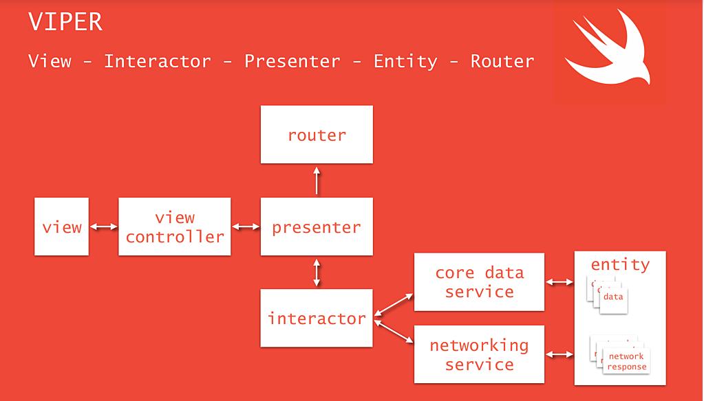

## 06月28号至09月28号生活安排
- 1.学习flutter
- 2.研究iOS新的设计模式
- 3.阅读http相关的书
- 4.健身减肥，两个月瘦下来

### 学习flutter时间安排
- 每周一三五晚上9点半以后至0点

### iOS设计模式时间安排
- 每周二四六晚上至0点

### 阅读http相关的书的时间安排
- 每周二四六晚上至0点

### 健身的时间安排
	
-  每周一，周三， 周五健身房跑步，撸铁，健身后吃营养餐（暂停吃蔬菜，鸡肉类的）
-  周六或周日打篮球

#### 健身日志

| 时间 | 跑步（分钟） | 力量训练（分钟） | 篮球 | 耗时(分钟) | 晚餐 |  体重 |
| ------ | ------ | ------ | ------ | ------ | -----| ------ |
| 2019.06.28 | 40 | 23 | | 63 | 西红柿一个，黄瓜一根，鸡蛋一个，煎蛋饼一个 |
|2019.06.29 | | | 180 | 180 | 稀饭，生菜，西瓜，鸭肉 |
| 2019.07.01| 44 | 43 | | 86 | 白菜，米饭，五花肉 | 144
| 2019.07.04| 44 | 43 | | 86 | 白菜，米饭，五花肉 | 144
| 2019.07.06| | | 180 | 180 | 白菜,面条，豆腐 | 
| 2019.07.10| 40 | 40|  | 80 | 白菜,面条 | 142
| 2019.07.14| | | 210 | 210 | 稀饭，凉面，烧鹅 | 142

### Flutter学习日志
- 2019.06.29 安装环境，YouTube Flutter demo演示
- 2019.07.01 尝试flutter 第一个demo，开始学习dart语法

### iOS设计模式
- Viper
	